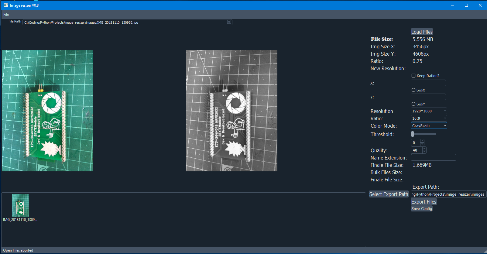

# Bulk-Image-compressor
Bulk image compressor and resizer essential for online application where speed is critical.

# Intro 

This is the first version of this image converter *not all the functionality
is verified and tested try at your own risk!!*

The app is based upon the PyQt5.15 framework for image resize compression and UI
allowd you to add a name extension to each formated img file

# Usage:

	1) Just Click  the load "Load Files" ( or use the shortcut CTRL+O) to load the images to be procecced 
	2) Configure the output according to the configuration option in the left
	3) Select export path by clicking the button "Select Export Path" or just paste the relative path in the line edit box
	near the button 
	
	4) Press export or shortcut CTRL+E and you will have your files resized and compressed according to the configurations.

##  Features that still don't work:

* Pure Black and white don't work propely with the Qt algorither and needs to be changed to
PIL's method soon.

* Keep Aspect ration check box ( Connect it to convertImages() )

## Future features:

	* More advanced functionality in the thumbnail image review bar 
	export selected individual images and per selection manipulation 
	
	* Warning pop up windows and loading screens:
		* Before image open, export

	* Calculate single selected or bulk *AFTER* compression file size
